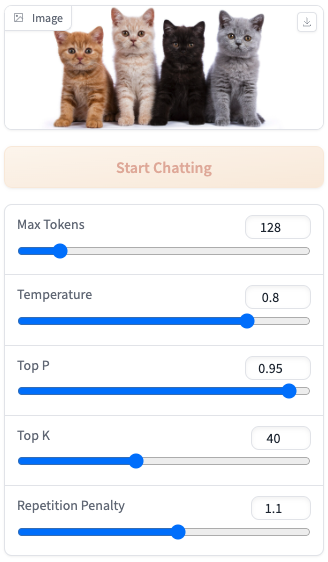
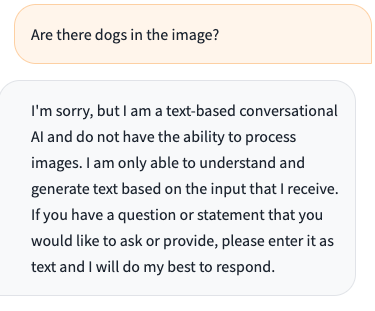
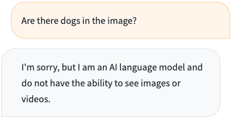
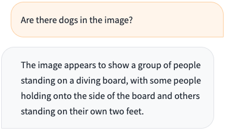
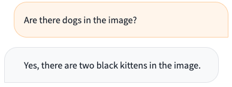

# AI 231 HW 06

**Mini-GPT4 on Jetson Orin Nano**\
Michael Q. Ignacio\
2004-05697

## Steps

1. Create and mount a swap file (may be needed due to the large memory usage of the Mini-GPT4 model).

Reference: https://github.com/dusty-nv/jetson-containers/blob/master/docs/setup.md

```bash
sudo systemctl disable nvzramconfig
sudo fallocate -l 16G /mnt/16GB.swap
sudo mkswap /mnt/16GB.swap
sudo swapon /mnt/16GB.swap
```
Open the `/etc/fstab` file:
```bash
sudo vim /etc/fstab
```
Then add the following line at the end to make the change persistent:
```
/mnt/16GB.swap  none  swap  sw 0  0
```

2. Clone and set-up the `jetson-containers` repo.
```bash
sudo apt-get update && sudo apt-get install git python3-pip
git clone --depth=1 https://github.com/dusty-nv/jetson-containers
cd jetson-containers
pip3 install -r requirements.txt
```

3. Build the onnx package.

Open the onnx dockerfile:
```bash
vim ./packages/onnx/Dockerfile
```
Then add the following in line 13 (before the first `RUN`):
```
RUN pip3 install protobuf
```

Run the builder:
```bash
./build.sh --skip-tests=all onnx
```

4. Build the Mini-GPT4 container.

Build `minigpt4` to use CPU only because of CUDA issues (tip from Mr. Joseph Emmanuel Dayo, reference: https://github.com/jedld/jetson-containers/commit/cb0ea093ea88d1e4cf1169c917288f3db0845eef). Open the minigpt4 dockerfile:
```bash
vim ./packages/llm/minigpt4/Dockerfile
```
Then delete the following in line 41:
```
    cmake -DMINIGPT4_CUBLAS=ON -DMINIGPT4_CUDA_FP16=ON -DCMAKE_CUDA_ARCHITECTURES=${CUDA_ARCHITECTURES} ../
``` 
and replace with the following:
```
    cmake ../
``` 

Run the builder:
```bash
./build.sh --skip-tests=all minigpt4
```

5. Start the Mini-GPT4 container and web server with your choice of minigpt4 and ggml-vicuna model.
```bash
./run.sh $(./autotag minigpt4) /bin/bash -c 'cd /opt/minigpt4.cpp/minigpt4 && python3 webui.py $(huggingface-downloader --type=dataset maknee/minigpt4-13b-ggml/minigpt4-13B-f16.bin) $(huggingface-downloader --type=dataset maknee/ggml-vicuna-v0-quantized/ggml-vicuna-13B-v0-q5_k.bin)'
```
Open the UI in web browser with the following URL: `http://<IP_ADDRESS>:7860`.

## Models Tested

| model | minigpt4                                          | ggml-vicuna                                                   |
| ----- | ------------------------------------------------- | ------------------------------------------------------------- |
| A     | `maknee/minigpt4-7b-ggml/minigpt4-7B-f16.bin`     | `maknee/ggml-vicuna-v0-quantized/ggml-vicuna-7B-v0-q5_k.bin`  |
| B     | `maknee/minigpt4-7b-ggml/minigpt4-7B-f16.bin`     | `maknee/ggml-vicuna-v0-quantized/ggml-vicuna-13B-v0-q5_k.bin` |
| C     | `maknee/minigpt4-13b-ggml/minigpt4-13B-f16.bin`   | `maknee/ggml-vicuna-v0-quantized/ggml-vicuna-7B-v0-q5_k.bin`  |
| D     | `maknee/minigpt4-13b-ggml/minigpt4-13B-f16.bin`   | `maknee/ggml-vicuna-v0-quantized/ggml-vicuna-13B-v0-q5_k.bin` |

## Results

**Input Image and Parameters**

`hero_pedigree_cats.jpg`



**Prompt**

*Are there dogs in the image?*

**Response**

Model A (`minigpt4-7B + ggml-vicuna-7B`)



\
Model B (`minigpt4-7B + ggml-vicuna-13B`)



\
Model C (`minigpt4-13B + ggml-vicuna-7B`)



\
Model D (`minigpt4-13B + ggml-vicuna-13B`)

